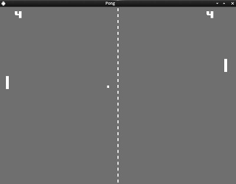

This is external Code, a non functional Pong.

---DO NOT CLONE FOR A REFERENCE PONG---

There are plenty of others.

However it compiles and Gamestates should be implemented.

This uses SDL2 Renderer and the extensions
SDL_Mixer, SDL_ttf.

Help on [Issue](https://discourse.libsdl.org/t/need-help-with-menus-in-my-game/24238)
on [SDL-Discourse](https://discourse.libsdl.org).

**Other Pong Clones:**  
[21st-century-pong](https://github.com/chaficnajjar/21st-century-pong) in C++  

[Pong-Clone](https://github.com/phao/pong) in C  

[Pong](https://en.wikipedia.org/wiki/Pong) usually leads to a [Breakout](https://en.wikipedia.org/wiki/Breakout_(video_game))

**Some Tutorials:**  
In C++ but SDL 1:  
[AAron Cox Tut](http://www.aaroncox.net/tutorials/arcade/PaddleBattle.html)
[AAron Cox BB Tut](http://www.aaroncox.net/tutorials/arcade/breakout.pdf)

[In JS but tons of Eye Candy](https://codeincomplete.com/posts/javascript-breakout/)

[In Java - Stanford Assignment](
https://web.stanford.edu/class/archive/cs/cs106a/cs106a.1178/assignments/breakout.html)  

[Breaking Down Breakout](http://www.gamasutra.com/view/feature/1630/breaking_down_breakout_system_and_.php?print=1)  

**Some higher quality clones with sources:**  

[LBreakout](http://lgames.sourceforge.net/LBreakout/)  

[LBreakout2](http://lgames.sourceforge.net/LBreakout2/)

[SDL-Ball](http://sdl-ball.sourceforge.net/)  

[DX-Ball](https://sourceforge.net/projects/dx-ball/)

Those are some titles like Arkanoid, DX • BΔLL, DX-Ball 2, Rival Ball, Super DX-Ball ...

[Ranking of Breakout Clones](https://www.ranker.com/list/the-best-breakout-clone-games-of-all-time/reference)